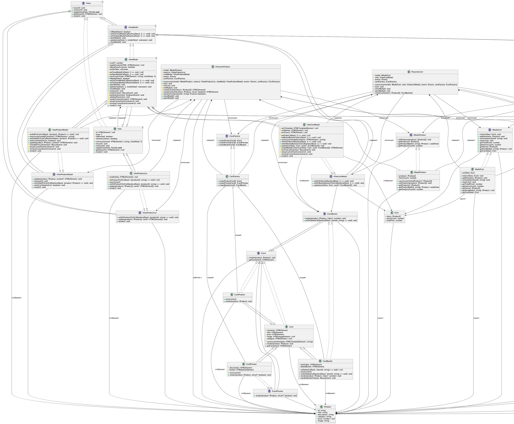

# Проектная работа "Веб-ларёк"

Учебное SPA‑приложение «Веб-ларёк» для просмотра каталога цифровых товаров, управления корзиной и оформления заказа.

---

## Технологический стек

- **HTML** — разметка страниц
- **SCSS** — стилизация компонентов
- **TypeScript** — типизированный JavaScript
- **Webpack** — сборка проекта

---

## Архитектура проекта

Приложение построено на архитектурном паттерне **MVP (Model-View-Presenter)** с использованием **EventBus** для взаимодействия между компонентами.

### Архитектурный паттерн MVP

**MVP (Model-View-Presenter)** — это архитектурный паттерн, который разделяет приложение на три основных слоя:

| Слой | Ответственность | Описание |
|------|----------------|----------|
| **Model** | Данные и бизнес‑логика | Хранение состояния приложения, бизнес-правила, работа с данными |
| **View** | DOM, UI, события пользователя | Отображение данных, обработка пользовательского ввода, работа с DOM |
| **Presenter** | Управление логикой и навигацией | Координация между Model и View, обработка бизнес-логики, управление событиями |

### Принципы проектирования

Приложение спроектировано согласно принципам **SOLID**:

- **S (Single Responsibility Principle)** — каждый модуль отвечает только за свою зону ответственности (Model/View/Presenter разделены)
- **O (Open/Closed Principle)** — расширение функциональности без изменения существующего кода благодаря выделению интерфейсов
- **L (Liskov Substitution Principle)** — строгая замена реализаций интерфейсов без изменения поведения
- **I (Interface Segregation Principle)** — интерфейсы разделены по функциональности (нет "толстых" контрактов)
- **D (Dependency Inversion Principle)** — компоненты зависят от абстракций (интерфейсов), а не от конкретных реализаций

### EventBus (Pub/Sub паттерн)

Взаимодействие между компонентами реализовано через **EventBus** (паттерн Publisher/Subscriber), что обеспечивает:

- **Слабую связанность** — компоненты не знают друг о друге напрямую
- **Единый источник данных (SSOT)** — данные хранятся в моделях, изменения распространяются через события
- **Расширяемость** — легко добавлять новые компоненты без изменения существующих

### Схема взаимодействия

```
Пользователь → View → Presenter → Model
Model → Presenter → View
Presenter → EventBus → Presenter
```

---

## Структура проекта

```
src/
  components/
    api/                      # API-клиенты для работы с сервером
      appApi.ts               # Единый API-сервис приложения
    appState/                 # Инициализация и состояние приложения
      appState.ts             # Координатор загрузки данных и управления модальными окнами
    base/                     # Базовые классы и утилиты
      api.ts                  # Базовый класс для HTTP-запросов
      events.ts               # EventEmitter (EventBus)
      form.ts                 # Базовый класс для работы с формами
    cards/                    # Компоненты карточек товаров
      card.ts                 # Базовый класс карточки
      cardBasket.ts           # Карточка товара в корзине
      cardFactory.ts          # Фабрика для создания карточек (Factory Pattern)
      cardPreview.ts          # Карточка товара в модальном окне
      cardProduct.ts          # Карточка товара в каталоге
    cart/                     # Модуль корзины
      model/
        modelCart.ts          # Модель корзины
      presenter/
        presenterCart.ts      # Презентер корзины
      view/
        viewCartModal.ts      # Представление модального окна корзины
    messages/                 # Компоненты сообщений
      successMessage.ts       # Сообщение об успешном заказе
    order/                    # Модуль оформления заказа
      forms/                  # Формы оформления заказа
        orderStep1Form.ts     # Форма шага 1 (оплата и адрес)
        orderStep2Form.ts     # Форма шага 2 (контакты)
      model/
        modelOreder.ts        # Модель заказа
      presenter/
        presenterOrder.ts     # Презентер заказа
      view/
        viewOrderModal.ts     # Представление модального окна заказа
    products/                 # Модуль каталога товаров
      model/
        modelProduct.ts       # Модель каталога товаров
      presenter/
        presenterProduct.ts   # Презентер каталога товаров
      view/
        viewProductList.ts    # Представление списка товаров
        viewProductModal.ts   # Представление модального окна товара
    view/                     # Базовые классы представлений
      view.ts                 # Базовый абстрактный класс View
    viewModal/                # Базовые классы модальных окон
      viewModal.ts            # Базовый абстрактный класс ViewModal

  types/                      # Типы и интерфейсы TypeScript
    components/               # Интерфейсы компонентов
      api/                    # Интерфейсы API
      appState/               # Интерфейсы состояния приложения
      cards/                  # Интерфейсы карточек
      cart/                   # Интерфейсы корзины
      order/                  # Интерфейсы заказа
      products/               # Интерфейсы товаров
      view/                   # Интерфейсы представлений
      viewModal/              # Интерфейсы модальных окон
    events.types.ts           # Типы событий EventBus
    index.ts                  # Экспорт всех типов

  utils/                      # Утилиты
    constants.ts              # Глобальные константы, селекторы, события
    utils.ts                  # Вспомогательные функции

  pages/                      # HTML-страницы
    index.html                # Главная страница

docs/                        # Документация
  web-ларёк UML-схема.jpg    # UML-схема (JPEG)
  web-ларёк UML-схема.png    # UML-схема (PNG)
  web-ларёк UML-схема.pdf    # UML-схема (PDF)
```

---

## UML‑диаграмма

Основная схема архитектуры приложения:


Схема архитектуры приложения PlantUML:



Более подробные версии доступны в каталоге `docs/`:
- `web-ларёк UML-схема.png` — версия в формате PNG (для README)
- `web-ларёк UML-схема.pdf` — версия в формате PDF без сжатия
- `uml-diagram.png` — диаграмма, сгенерированная из `uml-diagram.puml`
- `uml-diagram.puml` — исходный файл PlantUML для генерации диаграммы

---

## Описание компонентов и моделей данных

### Модели данных (Model)

Модели отвечают за хранение данных и бизнес-логику приложения. Все модели реализуют соответствующие интерфейсы из `src/types/components/`.

#### `ModelProduct` — модель каталога товаров

**Назначение:** Хранение списка товаров и предоставление доступа к данным каталога.

**Расположение:** `src/components/products/model/modelProduct.ts`

**Интерфейс:** `IModelProduct`

**Конструктор:**
- `initialProducts: IProduct[] = []` — начальный массив товаров (опциональный, по умолчанию пустой массив)

**Состояние:**
- `products: IProduct[]` — массив товаров
- `itemsCount: number` — количество товаров

**Методы:**

| Метод | Параметры | Возвращает | Описание |
|-------|-----------|------------|----------|
| `setProducts(products: IProduct[])` | `products` — массив товаров | `void` | Полностью перезаписывает список товаров в модели |
| `getProducts()` | — | `IProduct[]` | Возвращает список всех товаров |
| `getProductById(id: string)` | `id` — идентификатор товара | `IProduct \| undefined` | Возвращает товар по идентификатору |
| `getProductsCount()` | — | `number` | Возвращает количество товаров в каталоге |

**Использование:**
- Инициализируется в `AppState` при загрузке товаров с сервера
- Используется в `PresenterProduct` для получения данных о товарах

---

#### `ModelCart` — модель корзины

**Назначение:** Управление выбранными пользователем товарами, расчёт итоговой стоимости, сохранение состояния в `localStorage`.

**Расположение:** `src/components/cart/model/modelCart.ts`

**Интерфейс:** `IModelCart`

**Конструктор:**
- Параметры отсутствуют (конструктор без параметров)

**Состояние:**
- `cartData: ICart` — объект корзины, содержащий:
  - `items: IProduct[]` — массив товаров в корзине
  - `itemsCount: number` — количество товаров
  - `totalPrice: number` — итоговая стоимость

**Методы:**

| Метод | Параметры | Возвращает | Описание |
|-------|-----------|------------|----------|
| `init(cartData: ICart)` | `cartData` — данные корзины | `void` | Инициализация модели из готовых данных |
| `addItem(item: IProduct)` | `item` — товар | `void` | Добавляет товар в корзину и сохраняет в `localStorage` |
| `removeItem(itemId: string)` | `itemId` — идентификатор товара | `void` | Удаляет товар по ID, пересчитывает сумму и сохраняет в `localStorage` |
| `clearCart()` | — | `void` | Полностью очищает корзину и `localStorage` |
| `getTotalPrice()` | — | `number` | Возвращает итоговую цену корзины |
| `getItemsCount()` | — | `number` | Возвращает количество товаров в корзине |
| `getItems()` | — | `IProduct[]` | Возвращает список товаров в корзине |
| `getItemById(id: string)` | `id` — идентификатор товара | `IProduct \| null` | Возвращает товар из корзины по ID или `null` |
| `getCartData()` | — | `ICart` | Возвращает полные данные корзины |

**Особенности:**
- Автоматическое сохранение состояния в `localStorage` при каждом изменении
- Предотвращение дублирования товаров (товар с одинаковым ID добавляется только один раз)
- Автоматический пересчёт итоговой суммы при добавлении/удалении товаров

**Использование:**
- Инициализируется в `AppState` при восстановлении корзины из `localStorage`
- Используется в `PresenterCart` для управления содержимым корзины

---

#### `ModelOrder` — модель заказа

**Назначение:** Хранение данных заказа, валидация контактных данных.

**Расположение:** `src/components/order/model/modelOreder.ts`

**Интерфейс:** `IModelOrder`

**Конструктор:**
- Параметры отсутствуют (конструктор без параметров)

**Состояние:**
- `orderData: IOrder` — объект заказа, содержащий:
  - `items: string[]` — массив идентификаторов товаров
  - `payment: PaymentMethod` — способ оплаты (`'online'` или `'offline'`)
  - `email: string` — email покупателя
  - `phone: string` — телефон покупателя
  - `address: string` — адрес доставки
  - `total: number` — итоговая сумма заказа

**Методы:**

| Метод | Параметры | Возвращает | Описание |
|-------|-----------|------------|----------|
| `setItems(items: string[])` | `items` — массив ID товаров | `void` | Устанавливает список товаров заказа |
| `setPaymentMethod(method: PaymentMethod)` | `method` — способ оплаты | `void` | Устанавливает способ оплаты |
| `setEmail(email: string)` | `email` — email | `void` | Устанавливает email с валидацией (RegExp) |
| `setPhone(phone: string)` | `phone` — телефон | `void` | Устанавливает телефон с валидацией (RegExp) |
| `setAddress(address: string)` | `address` — адрес | `void` | Устанавливает адрес доставки |
| `setTotal(total: number)` | `total` — сумма | `void` | Устанавливает итоговую стоимость заказа |
| `clearData()` | — | `void` | Полный сброс данных заказа к начальному состоянию |
| `getOrderData()` | — | `IOrder` | Возвращает полные данные заказа |

**Валидация:**
- Email валидируется регулярным выражением: `/^[\wА-Яа-яёЁ.%+-]+@[A-Za-zА-Яа-яёЁ0-9-]+(?:\.[A-Za-zА-Яа-яёЁ0-9-]+)+$/`
- Телефон валидируется регулярным выражением: `/^(\+7|8)\D*\d{3}\D*\d{3}\D*\d{2}\D*\d{2}$/`
- При невалидных данных выбрасывается исключение `Error`

**Использование:**
- Используется в `PresenterOrder` для хранения и валидации данных заказа

---

### Представления (View)

Представления отвечают за работу с DOM, отображение данных и проброс пользовательских действий во внешний слой (Presenter). View не содержит бизнес‑логики и не изменяет модели напрямую.

#### Базовые классы представлений

##### `View<S>` — базовый абстрактный класс представлений

**Назначение:** Базовый класс для всех представлений, работающих с DOM.

**Расположение:** `src/components/view/view.ts`

**Интерфейс:** `IView<S>`

**Конструктор:**
- `root: HTMLElement | string` — DOM-элемент или селектор корневого элемента
- `initialState: S` — начальное состояние компонента типа `S`

**Состояние:**
- `el: HTMLElement | null` — корневой DOM-элемент представления (protected)
- `state: S` — состояние представления типа `S` (protected)
- `isMounted: boolean` — флаг монтирования компонента (protected)
- `isEventListeners: boolean` — флаг установки обработчиков событий (protected)

**Методы:**

| Метод | Параметры | Возвращает | Описание |
|-------|-----------|------------|----------|
| `mount()` | — | `void` | Монтирует компонент в DOM (вызывает `render()`) |
| `unmount()` | — | `void` | Демонтирует компонент из DOM (очищает содержимое) |
| `update(newState: Partial<S>)` | `newState` — частичное состояние | `void` | Обновляет состояние и перерисовывает компонент, если он смонтирован |
| `getElement()` | — | `HTMLElement \| null` | Возвращает корневой DOM-элемент |
| `render()` | — | `void` | Абстрактный метод рендеринга (должен быть реализован в наследниках) |

---

##### `ViewModal<S>` — базовый абстрактный класс для модальных окон

**Назначение:** Базовый класс для всех модальных окон, наследуется от `View<S>`.

**Расположение:** `src/components/viewModal/viewModal.ts`

**Интерфейс:** `IViewModal<S>`

**Конструктор:**
- `root: HTMLElement | string` — DOM-элемент или селектор контейнера модального окна
- `initialState: S` — начальное состояние компонента типа `S`

**Дополнительное состояние:**
- `onCloseModalCallback: () => void | null` — коллбек на закрытие модального окна (protected)
- `onOpenModalCallback: () => void | null` — коллбек на открытие модального окна (protected)
- `scrollY: number` — позиция прокрутки страницы перед открытием модального окна (protected)
- `modalContentHTML: HTMLElement | null` — контейнер содержимого модального окна (protected)
- `isBaseEventListeners: boolean` — флаг установки базовых обработчиков событий (protected)
- `renderData: unknown` — дополнительные данные для рендеринга (protected)

**Методы:**

| Метод | Параметры | Возвращает | Описание |
|-------|-----------|------------|----------|
| `isModalOpen()` | — | `boolean` | Проверяет, открыто ли модальное окно |
| `setOnOpenModalCallback(callback)` | `callback` — функция | `void` | Задаёт функцию-коллбек на открытие модального окна |
| `setOnCloseModalCallback(callback)` | `callback` — функция | `void` | Задаёт функцию-коллбек на закрытие модального окна |
| `openModal()` | — | `void` | Открывает модальное окно (блокирует прокрутку страницы, добавляет в DOM, показывает) |
| `closeModal()` | — | `void` | Закрывает модальное окно (восстанавливает прокрутку, прячет, удаляет из DOM) |
| `update(newState: S, renderData?: unknown)` | `newState` — новое состояние, `renderData` — опциональные данные для рендеринга | `void` | Обновляет состояние и данные для рендеринга, вызывает `render()` если модальное окно открыто |

**Особенности:**
- Автоматическая обработка клика по фону и кнопке закрытия для закрытия окна
- Обработка нажатия клавиши `Escape` для закрытия окна
- Блокировка прокрутки страницы при открытии модального окна
- Восстановление позиции прокрутки при закрытии

---

#### `ViewProductList` — представление списка товаров

**Назначение:** Отображение списка товаров каталога и делегирование кликов по карточкам.

**Расположение:** `src/components/products/view/viewProductList.ts`

**Интерфейс:** `IViewProductList extends IView<IProduct[]>`

**Конструктор:**
- Параметры отсутствуют (конструктор без параметров)

**Методы:**

| Метод | Параметры | Возвращает | Описание |
|-------|-----------|------------|----------|
| `update(products: IProduct[], cards?: HTMLElement[])` | `products` — массив товаров, `cards` — опциональный массив готовых карточек | `void` | Обновляет состояние и отображает каталог товаров |
| `setOnProductClickCallback(callback)` | `callback: (productId: string) => void` | `void` | Задаёт коллбек обработки кликов по товарам |
| `render()` | — | `void` | Рендерит список товаров в DOM |

**Использование:**
- Используется в `PresenterProduct` для отображения каталога товаров

---

#### `ViewProductModal` — представление модального окна товара

**Назначение:** Отображение деталей товара и возможность добавления его в корзину.

**Расположение:** `src/components/products/view/viewProductModal.ts`

**Интерфейс:** `IViewProductModal extends IViewModal<IProduct>`

**Конструктор:**
- `modalContainer: HTMLElement | string = SELECTORS.IDS.MODAL_CONTAINER` — DOM-элемент или селектор контейнера модального окна (опциональный, по умолчанию используется селектор из констант)

**Методы:**

| Метод | Параметры | Возвращает | Описание |
|-------|-----------|------------|----------|
| `update(product: IProduct, content?: HTMLElement)` | `product` — товар, `content` — опциональный готовый контент | `void` | Обновляет состояние модального окна данными товара |
| `setOnAddToCartCallback(callback)` | `callback: (product: IProduct) => void` | `void` | Устанавливает коллбек, который вызывается при добавлении товара в корзину |
| `setInCartState(inCart: boolean)` | `inCart` — флаг наличия в корзине | `void` | Устанавливает состояние кнопки "Купить" (активна/неактивна) |
| `render()` | — | `void` | Рендерит содержимое модального окна |
| `unmount()` | — | `void` | Размонтирует модальное окно |

**Использование:**
- Используется в `PresenterProduct` для отображения деталей товара

---

#### `ViewCartModal` — представление модального окна корзины

**Назначение:** Отображение содержимого корзины, возможность удаления товаров и перехода к оформлению заказа.

**Расположение:** `src/components/cart/view/viewCartModal.ts`

**Интерфейс:** `IViewCartModal extends IViewModal<ICart>`

**Конструктор:**
- `modalContainer: HTMLElement | string` — DOM-элемент или селектор контейнера модального окна

**Методы:**

| Метод | Параметры | Возвращает | Описание |
|-------|-----------|------------|----------|
| `update(cartData: ICart, cards?: ICardBasket[])` | `cartData` — данные корзины, `cards` — опциональный массив готовых карточек | `void` | Обновляет отображение корзины по актуальным данным |
| `setOnOrderCallback(callback)` | `callback: () => void` | `void` | Устанавливает коллбек на нажатие кнопки оформления заказа |
| `setOnBasketButtonClickCallback(callback)` | `callback: () => void` | `void` | Устанавливает коллбек на клик по кнопке корзины в хедере (логика открытия модального окна управляется презентером) |

**Использование:**
- Используется в `PresenterCart` для отображения корзины

---

#### `ViewOrderModal` — представление модального окна оформления заказа

**Назначение:** Пошаговое оформление заказа с валидацией данных.

**Расположение:** `src/components/order/view/viewOrderModal.ts`

**Интерфейс:** `IViewOrderModal extends IViewModal<IOrder>`

**Конструктор:**
- `modalContainer: HTMLElement | string = SELECTORS.IDS.MODAL_CONTAINER` — DOM-элемент или селектор контейнера модального окна (опциональный, по умолчанию используется селектор из констант)

**Методы:**

| Метод | Параметры | Возвращает | Описание |
|-------|-----------|------------|----------|
| `update(orderData: IOrder, content?: HTMLElement)` | `orderData` — данные заказа, `content` — опциональный готовый контент | `void` | Обновляет состояние UI на основе данных заказа |

**Использование:**
- Используется в `PresenterOrder` для отображения процесса оформления заказа

---

### Презентеры (Presenter)

Презентеры управляют бизнес‑логикой, взаимодействуют с моделями и обновляют View. Связь между модулями происходит через централизованный `EventBus`, что исключает прямые зависимости.

#### `PresenterProduct` — презентер каталога товаров

**Назначение:** Координация между моделью каталога (`ModelProduct`) и представлениями (`ViewProductList`, `ViewProductModal`).

**Расположение:** `src/components/products/presenter/presenterProduct.ts`

**Конструктор:**
- `model: IModelProduct` — модель каталога товаров
- `viewList: IViewProductList` — представление списка товаров
- `viewModal: IViewProductModal` — представление модального окна товара
- `events: IEvents` — система событий (EventBus)
- `cardFactory: ICardFactory` — фабрика для создания карточек товаров

**Зависимости:**
- `IModelProduct` — модель каталога товаров
- `IViewProductList` — представление списка товаров
- `IViewProductModal` — представление модального окна товара
- `IEvents` — система событий (EventBus)
- `ICardFactory` — фабрика для создания карточек товаров

**Публичные методы:**

| Метод | Параметры | Возвращает | Описание |
|-------|-----------|------------|----------|
| `init()` | — | `void` | Инициализирует презентер (подписка на события, настройка коллбеков) |
| `checkInCart(productId: string)` | `productId` — идентификатор товара | `Promise<boolean>` | Проверяет, находится ли товар в корзине (асинхронно через EventBus) |
| `openModal()` | — | `void` | Открывает модальное окно товара |
| `closeModal()` | — | `void` | Закрывает модальное окно товара |

**Обрабатываемые события:**

| Событие | Действие |
|---------|----------|
| `PRODUCT_EVENTS.PRODUCTS_LOADED` | Получает товары из модели и обновляет `ViewProductList` |

**Эмитируемые события:**

| Событие | Данные | Описание |
|---------|--------|----------|
| `CART_EVENTS.CART_PRODUCT_ADD` | `IProduct` | Эмитируется при добавлении товара в корзину |
| `CART_EVENTS.CART_CHECK_ITEM` | `CartCheckRequest` | Эмитируется для проверки наличия товара в корзине |
| `SYSTEM_EVENTS.MODAL_OPEN` | `{ modalName: string }` | Эмитируется при открытии модального окна |
| `SYSTEM_EVENTS.MODAL_CLOSE` | `{ modalName: string }` | Эмитируется при закрытии модального окна |

**Поток данных:**
1. При загрузке товаров (`PRODUCTS_LOADED`) → получает товары из модели → создаёт карточки через `CardFactory` → обновляет `ViewProductList`
2. При клике на товар → получает товар из модели по ID → проверяет наличие в корзине → открывает модальное окно с данными товара
3. При добавлении в корзину → закрывает модальное окно → эмитирует `CART_PRODUCT_ADD`

---

#### `PresenterCart` — презентер корзины

**Назначение:** Координация между моделью корзины (`ModelCart`), представлением корзины (`ViewCartModal`) и другими модулями.

**Расположение:** `src/components/cart/presenter/presenterCart.ts`

**Конструктор:**
- `model: IModelCart` — модель корзины
- `view: IViewCartModal` — представление модального окна корзины
- `events: IEvents` — система событий (EventBus)
- `cardFactory: ICardFactory` — фабрика для создания карточек товаров

**Зависимости:**
- `IModelCart` — модель корзины
- `IViewCartModal` — представление модального окна корзины
- `IEvents` — система событий (EventBus)
- `ICardFactory` — фабрика для создания карточек товаров

**Методы:**

| Метод | Параметры | Возвращает | Описание |
|-------|-----------|------------|----------|
| `init()` | — | `void` | Инициализирует презентер (подписка на события, настройка коллбеков, установка обработчика клика на кнопку корзины) |
| `openModal()` | — | `void` | Открывает модальное окно корзины, обновляет его данными и эмитирует событие `MODAL_OPEN` |
| `closeModal()` | — | `void` | Закрывает модальное окно корзины и эмитирует событие `MODAL_CLOSE` |

**Обрабатываемые события:**

| Событие | Действие |
|---------|----------|
| `CART_EVENTS.CART_LOADED` | Обновляет представление корзины после восстановления из `localStorage` |
| `CART_EVENTS.CART_PRODUCT_ADD` | Добавляет товар в модель корзины и обновляет представление |
| `CART_EVENTS.CART_CHECK_ITEM` | Проверяет наличие товара в корзине и отвечает через коллбек |

**Эмитируемые события:**

| Событие | Данные | Описание |
|---------|--------|----------|
| `CART_EVENTS.CART_COMPLETE` | `ICart` | Эмитируется при переходе к оформлению заказа (передаёт данные корзины) |
| `CART_EVENTS.CART_PRODUCT_DELETE` | `void` | Эмитируется после удаления товара из корзины |
| `SYSTEM_EVENTS.MODAL_OPEN` | `{ modalName: string }` | Эмитируется при открытии модального окна корзины |
| `SYSTEM_EVENTS.MODAL_CLOSE` | `{ modalName: string }` | Эмитируется при закрытии модального окна корзины |

**Поток данных:**
1. При инициализации (`init()`) → устанавливает коллбеки на открытие/закрытие модального окна и клик по кнопке корзины в хедере
2. При клике на кнопку корзины в хедере → вызывается `openModal()` → получает данные из модели → создаёт карточки → обновляет представление → эмитирует `MODAL_OPEN`
3. При загрузке корзины (`CART_LOADED`) → получает данные из модели → обновляет представление (если модальное окно открыто, также обновляет карточки)
4. При добавлении товара (`CART_PRODUCT_ADD`) → добавляет товар в модель → обновляет представление (если модальное окно открыто, также обновляет карточки)
5. При удалении товара (через коллбек карточки) → удаляет товар из модели → обновляет представление → эмитирует `CART_PRODUCT_DELETE`
6. При оформлении заказа → очищает корзину → закрывает модальное окно → эмитирует `CART_COMPLETE` с данными корзины

---

#### `PresenterOrder` — презентер оформления заказа

**Назначение:** Пошаговый процесс оформления заказа и интеграция с серверным API.

**Расположение:** `src/components/order/presenter/presenterOrder.ts`

**Конструктор:**
- `model: IModelOrder` — модель заказа
- `api: IAppApi` — API-клиент для отправки заказа
- `view: IViewOrderModal` — представление модального окна заказа
- `events: IEvents` — система событий (EventBus)
- `successMessageFactory: ISuccessMessageFactory` — фабрика для создания успешных сообщений о заказе
- `orderStep1FormFactory: IOrderStep1FormFactory` — фабрика для создания формы шага 1 заказа
- `orderStep2FormFactory: IOrderStep2FormFactory` — фабрика для создания формы шага 2 заказа

**Зависимости:**
- `IModelOrder` — модель заказа
- `IAppApi` — API-клиент для отправки заказа
- `IViewOrderModal` — представление модального окна заказа
- `IEvents` — система событий (EventBus)
- `ISuccessMessageFactory` — интерфейс фабрики успешных сообщений о заказе
- `IOrderStep1FormFactory` — интерфейс фабрики формы шага 1 заказа
- `IOrderStep2FormFactory` — интерфейс фабрики формы шага 2 заказа

**Состояние:**
- `currentStep: OrderStep` — текущий шаг оформления заказа (`'1'`, `'2'`, `'3'`, `'4'`)
- `orderId: string | null` — идентификатор заказа (после успешной отправки)
- `orderErrorMessage: string | null` — сообщение об ошибке (при неудачной отправке)

**Публичные методы:**

| Метод | Параметры | Возвращает | Описание |
|-------|-----------|------------|----------|
| `init()` | — | `void` | Инициализирует презентер (подписка на события, настройка коллбеков) |
| `openModal()` | — | `void` | Открывает модальное окно заказа |
| `closeModal()` | — | `void` | Закрывает модальное окно заказа и сбрасывает состояние |
| `goToStep(step: OrderStep, orderData?: IOrder)` | `step` — шаг, `orderData` — опциональные данные заказа | `void` | Переходит на указанный шаг оформления заказа |

**Защищённые методы:**

| Метод | Параметры | Возвращает | Описание |
|-------|-----------|------------|----------|
| `submitOrder()` | — | `Promise<void>` | Отправляет заказ на сервер (вызывается из формы шага 2) |

**Обрабатываемые события:**

| Событие | Действие |
|---------|----------|
| `CART_EVENTS.CART_COMPLETE` | Получает данные корзины, заполняет модель заказа и открывает модальное окно оформления |

**Эмитируемые события:**

| Событие | Данные | Описание |
|---------|--------|----------|
| `ORDER_EVENTS.ORDER_SUBMIT` | `void` | Эмитируется при успешном оформлении заказа |
| `ORDER_EVENTS.ORDER_STEP` | `{ step: OrderStep }` | Эмитируется при смене шага оформления заказа |
| `SYSTEM_EVENTS.MODAL_OPEN` | `{ modalName: string }` | Эмитируется при открытии модального окна заказа |
| `SYSTEM_EVENTS.MODAL_CLOSE` | `{ modalName: string }` | Эмитируется при закрытии модального окна заказа |

**Шаги оформления заказа:**

1. **Шаг 1** — выбор способа оплаты и ввод адреса доставки
2. **Шаг 2** — ввод email и телефона с валидацией, отправка заказа на сервер
3. **Шаг 3** — отображение успешного результата с номером заказа
4. **Шаг 4** — отображение ошибки при неудачной отправке заказа

**Поток данных:**
1. При получении `CART_COMPLETE` → заполняет модель заказа данными из корзины → открывает модальное окно → переходит на шаг 1
2. На шаге 1 → пользователь выбирает способ оплаты и вводит адрес → данные сохраняются в модель → переход на шаг 2
3. На шаге 2 → пользователь вводит email и телефон → валидация → данные сохраняются в модель → отправка заказа на сервер → переход на шаг 3 (успех) или шаг 4 (ошибка)
4. На шаге 3 → отображение номера заказа → при закрытии → очистка модели → закрытие модального окна

---

### API‑клиенты

Для работы с сервером используется базовый абстрактный класс `Api`, обеспечивающий выполнение HTTP‑запросов и обработку ошибок. Конкретные реализации формируют строго типизированные запросы на основе интерфейсов данных.

#### Базовый класс `Api`

**Назначение:** Базовый класс для всех API‑клиентов, обеспечивающий выполнение HTTP‑запросов.

**Расположение:** `src/components/base/api.ts`

**Конструктор:**
- `baseUrl: string` — базовый URL API
- `options: RequestInit = {}` — опции для HTTP‑запросов (опциональный, по умолчанию пустой объект)

**Состояние:**
- `baseUrl: string` — базовый URL API (readonly)
- `options: RequestInit` — опции для HTTP‑запросов (protected)

**Методы:**

| Метод | Параметры | Возвращает | Описание |
|-------|-----------|------------|----------|
| `get<T>(uri: string)` | `uri` — путь к ресурсу | `Promise<T>` | Выполняет GET‑запрос и возвращает данные требуемого типа |
| `post<T>(uri: string, data: object, method?: ApiPostMethods)` | `uri` — путь, `data` — тело запроса, `method` — метод (`'POST'`, `'PUT'`, `'DELETE'`) | `Promise<T>` | Выполняет POST/PUT/DELETE‑запрос с телом `data` и возвращает результат |
| `handleResponse<T>(response: Response)` | `response` — объект Response | `Promise<T>` | Единая обработка статуса и JSON‑ответа сервера (protected) |
| `normalizeUrl(uri: string)` | `uri` — путь | `string` | Нормализует URL (protected) |

**Особенности:**
- Автоматическая установка заголовка `Content-Type: application/json`
- Единая обработка ошибок HTTP‑запросов
- Типизация ответов через дженерики TypeScript

---

#### `AppApi` — единый API‑сервис приложения

**Назначение:** Единый API‑клиент для всех запросов к серверу.

**Расположение:** `src/components/api/appApi.ts`

**Интерфейс:** `IAppApi`

**Конструктор:**
- `baseUrl: string` — базовый URL API
- `options: RequestInit = {}` — опции для HTTP‑запросов (опциональный, по умолчанию пустой объект)

**Методы:**

| Метод | Параметры | Возвращает | Описание |
|-------|-----------|------------|----------|
| `getProducts()` | — | `Promise<IProduct[]>` | Получение списка всех товаров |
| `getProductById(id: string)` | `id` — идентификатор товара | `Promise<IProduct>` | Получение одного товара по его идентификатору |
| `postOrder(order: IOrder)` | `order` — данные заказа | `Promise<IPostOrderResponse>` | Отправка данных заказа на сервер |

**HTTP‑запросы:**

```
GET /product/
Response: ApiListResponse<IProduct> (содержит items: IProduct[])

GET /product/{id}
Response: IProduct

POST /order/
Body: IOrder
Response: IPostOrderResponse { id: string, total: number }
```

**Использование:**
- Используется в `AppState` для загрузки товаров при инициализации приложения
- Используется в `PresenterOrder` для отправки заказа на сервер

---

### Вспомогательные компоненты

#### `AppState` — координатор инициализации

**Назначение:** Инициализация данных приложения, восстановление состояния корзины, управление состоянием модальных окон.

**Расположение:** `src/components/appState/appState.ts`

**Интерфейс:** `IAppState`

**Конструктор:**
- `modelProduct: IModelProduct` — модель каталога товаров
- `modelCart: IModelCart` — модель корзины
- `modelOrder: IModelOrder` — модель заказа
- `events: IEvents` — шина событий приложения
- `api: IAppApi` — API‑клиент загрузки товаров

**Методы:**

| Метод | Параметры | Возвращает | Описание |
|-------|-----------|------------|----------|
| `init()` | — | `Promise<void>` | Инициализирует приложение: загружает товары и восстанавливает корзину |

**Роль в архитектуре:**
- Запускает приложение: загружает товары через API, восстанавливает корзину из `localStorage`
- Загружает товары через `api.getProducts()` и эмитирует `PRODUCT_EVENTS.PRODUCTS_LOADED` или `PRODUCT_EVENTS.PRODUCTS_LOAD_FAILED`
- Восстанавливает состояние корзины из `localStorage` при старте страницы и эмитирует `CART_EVENTS.CART_LOADED`
- Хранит и контролирует информацию о том, какая модалка открыта, реагируя на `SYSTEM_EVENTS.MODAL_OPEN` и `SYSTEM_EVENTS.MODAL_CLOSE`

**Поток инициализации:**
1. Загрузка товаров с сервера → сохранение в `ModelProduct` → эмит `PRODUCTS_LOADED`
2. Восстановление корзины из `localStorage` → добавление товаров в `ModelCart` → эмит `CART_LOADED`
3. Подписка на события открытия/закрытия модальных окон для контроля состояния

---

#### `CardFactory` — фабрика карточек товаров

**Назначение:** Централизованное создание карточек товаров разных типов (паттерн Factory).

**Расположение:** `src/components/cards/cardFactory.ts`

**Интерфейс:** `ICardFactory`

**Конструктор:**
- Параметры отсутствуют (конструктор без параметров)

**Методы:**

| Метод | Параметры | Возвращает | Описание |
|-------|-----------|------------|----------|
| `createProductCard()` | — | `ICard` | Создаёт карточку товара для каталога (`CardProduct`) |
| `createPreviewCard()` | — | `ICardPreview` | Создаёт карточку товара для предпросмотра (`CardPreview`) |
| `createBasketCard()` | — | `ICardBasket` | Создаёт карточку товара для корзины (`CardBasket`) |

**Использование:**
- Используется в `PresenterProduct` для создания карточек каталога и предпросмотра
- Используется в `PresenterCart` для создания карточек корзины

---

#### `SuccessMessage` — компонент успешного сообщения о заказе

**Назначение:** Отображение успешного сообщения о заказе с номером заказа и итоговой стоимостью.

**Расположение:** `src/components/messages/successMessage.ts`

**Интерфейс:** `ISuccessMessage`

**Конструктор:**
- Параметры отсутствуют (конструктор без параметров)

**Методы:**

| Метод | Параметры | Возвращает | Описание |
|-------|-----------|------------|----------|
| `setOrderData(orderId: string, total: number)` | `orderId` — идентификатор заказа, `total` — итоговая стоимость | `void` | Устанавливает данные заказа (номер заказа и сумма списания) |
| `setOnCloseCallback(callback: () => void)` | `callback` — функция-обработчик | `void` | Устанавливает обработчик на кнопку закрытия сообщения |
| `getContainer()` | — | `HTMLElement` | Возвращает DOM-элемент контейнера сообщения |

**Использование:**
- Используется в `PresenterOrder` для отображения успешного результата оформления заказа (шаг 3)
- Создаётся через фабрику `SuccessMessageFactory`, которая передаётся в конструктор `PresenterOrder`, что обеспечивает зависимость от абстракции (`ISuccessMessageFactory`)

---

#### `SuccessMessageFactory` — фабрика успешных сообщений о заказе

**Назначение:** Централизованное создание успешных сообщений о заказе (паттерн Factory).

**Расположение:** `src/components/messages/successMessageFactory.ts`

**Интерфейс:** `ISuccessMessageFactory`

**Конструктор:**
- Параметры отсутствуют (конструктор без параметров)

**Методы:**

| Метод | Параметры | Возвращает | Описание |
|-------|-----------|------------|----------|
| `create()` | — | `ISuccessMessage` | Создаёт экземпляр успешного сообщения о заказе |

**Использование:**
- Используется в `PresenterOrder` для создания экземпляров успешных сообщений о заказе
- Передаётся в конструктор `PresenterOrder`, что обеспечивает зависимость от абстракции (`ISuccessMessageFactory`)

---

#### `OrderStep1FormFactory` — фабрика формы шага 1 заказа

**Назначение:** Централизованное создание форм шага 1 заказа (паттерн Factory).

**Расположение:** `src/components/order/forms/orderStep1FormFactory.ts`

**Интерфейс:** `IOrderStep1FormFactory`

**Конструктор:**
- Параметры отсутствуют (конструктор без параметров)

**Методы:**

| Метод | Параметры | Возвращает | Описание |
|-------|-----------|------------|----------|
| `create(form, defaultPayment, submitHandler)` | `form` — DOM-элемент формы, `defaultPayment` — способ оплаты по умолчанию, `submitHandler` — обработчик отправки | `IOrderStep1Form` | Создаёт экземпляр формы шага 1 заказа |

**Использование:**
- Используется в `PresenterOrder` для создания форм шага 1 заказа
- Передаётся в конструктор `PresenterOrder`, что обеспечивает зависимость от абстракции (`IOrderStep1FormFactory`)

---

#### `OrderStep2FormFactory` — фабрика формы шага 2 заказа

**Назначение:** Централизованное создание форм шага 2 заказа (паттерн Factory).

**Расположение:** `src/components/order/forms/orderStep2FormFactory.ts`

**Интерфейс:** `IOrderStep2FormFactory`

**Конструктор:**
- Параметры отсутствуют (конструктор без параметров)

**Методы:**

| Метод | Параметры | Возвращает | Описание |
|-------|-----------|------------|----------|
| `create(form, submitHandler, emailValidator, phoneValidator)` | `form` — DOM-элемент формы, `submitHandler` — обработчик отправки, `emailValidator` — валидатор email, `phoneValidator` — валидатор телефона | `IOrderStep2Form` | Создаёт экземпляр формы шага 2 заказа |

**Использование:**
- Используется в `PresenterOrder` для создания форм шага 2 заказа
- Передаётся в конструктор `PresenterOrder`, что обеспечивает зависимость от абстракции (`IOrderStep2FormFactory`)

---

#### `EventEmitter` (EventBus) — система событий

**Назначение:** Централизованный механизм событий для взаимодействия между модулями без прямых зависимостей.

**Расположение:** `src/components/base/events.ts`

**Интерфейс:** `IEvents`

**Конструктор:**
- Параметры отсутствуют (конструктор без параметров)

**Методы интерфейса `IEvents`:**

| Метод | Параметры | Возвращает | Описание |
|-------|-----------|------------|----------|
| `on<T>(event: EventName, callback: (data: T) => void)` | `event` — имя события или RegExp, `callback` — обработчик | `void` | Устанавливает обработчик на событие |
| `emit<T>(event: string, data?: T)` | `event` — имя события, `data` — данные события | `void` | Инициирует событие с данными |
| `trigger<T>(eventName: string, context?: Partial<T>)` | `eventName` — имя события, `context` — контекст | `(event: object) => void` | Создаёт триггер, генерирующий событие при вызове |

**Дополнительные методы класса `EventEmitter` (не входят в интерфейс):**

| Метод | Параметры | Возвращает | Описание |
|-------|-----------|------------|----------|
| `off(event: EventName, callback: Subscriber)` | `event` — имя события, `callback` — обработчик | `void` | Снимает обработчик с события |
| `onAll(callback: (event: EmitterEvent) => void)` | `callback` — обработчик всех событий | `void` | Слушает все события (подписка на `'*'`) |
| `offAll()` | — | `void` | Сбрасывает все обработчики |

**Особенности:**
- Поддержка подписки на события по шаблону (RegExp)
- Поддержка подписки на все события через `'*'`
- Типизация событий через дженерики TypeScript
- Обеспечение слабой связанности между компонентами

**Типы событий:**
- `PRODUCT_EVENTS` — события каталога товаров
- `CART_EVENTS` — события корзины
- `ORDER_EVENTS` — события заказа
- `SYSTEM_EVENTS` — системные события (модальные окна)

---

## Типы данных

Все типы данных определены в каталоге `src/types/` и экспортируются через `src/types/index.ts`.

### Основные типы данных

#### `IProduct` — товар

```typescript
interface IProduct {
  id: string;           // Идентификатор товара
  title: string;        // Название товара
  description: string;  // Описание товара
  category: string;     // Категория товара
  price: number | null; // Цена товара (может быть null)
  image: string;        // Путь к изображению товара
}
```

**Расположение:** `src/types/components/products/model/modelProduct.interface.ts`

---

#### `ICart` — корзина

```typescript
interface ICart {
  items: IProduct[];      // Массив товаров в корзине
  itemsCount: number;    // Количество товаров
  totalPrice: number;    // Итоговая стоимость
}
```

**Расположение:** `src/types/components/cart/model/modelCart.interface.ts`

---

#### `IOrder` — заказ

```typescript
interface IOrder {
  items: string[];              // Массив идентификаторов товаров
  payment: PaymentMethod;        // Способ оплаты ('online' | 'offline')
  email: string;                // Email покупателя
  phone: string;                 // Телефон покупателя
  address: string;               // Адрес доставки
  total: number;                 // Итоговая сумма заказа
}
```

**Расположение:** `src/types/components/order/model/modelOrder.interface.ts`

**Связанные типы:**
- `PaymentMethod = 'online' | 'offline'` — способ оплаты
- `OrderStep = '1' | '2' | '3' | '4'` — шаг оформления заказа

---

#### `IPostOrderResponse` — ответ сервера на создание заказа

```typescript
interface IPostOrderResponse {
  id: string;    // Идентификатор заказа
  total: number; // Итоговая сумма заказа
}
```

**Расположение:** `src/types/components/order/api/orederApi.interface.ts`

---

### Интерфейсы компонентов

#### `ISuccessMessage` — интерфейс компонента успешного сообщения о заказе

**Назначение:** Определяет контракт для компонента, отображающего успешное сообщение о заказе.

**Расположение:** `src/types/components/messages/successMessage.interface.ts`

**Методы:**

| Метод | Параметры | Возвращает | Описание |
|-------|-----------|------------|----------|
| `setOrderData(orderId: string, total: number)` | `orderId` — идентификатор заказа, `total` — итоговая стоимость | `void` | Устанавливает данные заказа (номер заказа и сумма списания) |
| `setOnCloseCallback(callback: () => void)` | `callback` — функция-обработчик | `void` | Устанавливает обработчик на кнопку закрытия сообщения |
| `getContainer()` | — | `HTMLElement` | Возвращает DOM-элемент контейнера сообщения |

**Реализуется:**
- `SuccessMessage` — класс компонента успешного сообщения о заказе

---

#### `ISuccessMessageFactory` — интерфейс фабрики успешных сообщений о заказе

**Назначение:** Определяет контракт для фабрики, создающей экземпляры успешных сообщений о заказе.

**Расположение:** `src/types/components/messages/successMessage.interface.ts`

**Методы:**

| Метод | Параметры | Возвращает | Описание |
|-------|-----------|------------|----------|
| `create()` | — | `ISuccessMessage` | Создаёт экземпляр успешного сообщения о заказе |

**Реализуется:**
- `SuccessMessageFactory` — класс фабрики успешных сообщений о заказе

---

### Интерфейсы компонентов

#### Интерфейсы моделей

- `IModelProduct` — интерфейс модели каталога товаров
- `IModelCart` — интерфейс модели корзины
- `IModelOrder` — интерфейс модели заказа

#### Интерфейсы представлений

- `IView<S>` — базовый интерфейс представления (дженерик)
- `IViewModal<S>` — базовый интерфейс модального окна (дженерик)
- `IViewProductList` — интерфейс представления списка товаров
- `IViewProductModal` — интерфейс представления модального окна товара
- `IViewCartModal` — интерфейс представления модального окна корзины
- `IViewOrderModal` — интерфейс представления модального окна заказа

#### Интерфейсы API

- `IAppApi` — интерфейс единого API‑сервиса приложения
- `IEvents` — интерфейс системы событий (EventBus)

#### Интерфейсы карточек

- `ICard` — базовый интерфейс карточки товара
- `ICardPreview` — интерфейс карточки предпросмотра
- `ICardBasket` — интерфейс карточки корзины
- `ICardFactory` — интерфейс фабрики карточек

#### Интерфейсы сообщений

- `ISuccessMessage` — интерфейс компонента успешного сообщения о заказе
- `ISuccessMessageFactory` — интерфейс фабрики успешных сообщений о заказе

#### Интерфейсы форм заказа

- `IOrderStep1Form` — интерфейс формы шага 1 заказа
- `IOrderStep2Form` — интерфейс формы шага 2 заказа
- `IOrderStep1FormFactory` — интерфейс фабрики формы шага 1 заказа
- `IOrderStep2FormFactory` — интерфейс фабрики формы шага 2 заказа

---

### Типы событий EventBus

Типы событий определены в `src/types/events.types.ts`:

```typescript
type ProductEventsPayload = {
  PRODUCTS_LOADED: void;
  PRODUCTS_LOAD_FAILED: void;
  PRODUCT_CLICK: IProduct;
  PRODUCT_SELECTED: IProduct;
};

type CartEventsPayload = {
  CART_LOADED: void;
  CART_PRODUCT_ADD: IProduct;
  CART_PRODUCT_DELETE: void;
  CART_COMPLETE: ICart;
  CART_CHECK_ITEM: ICartCheckRequestPayload;
};

type OrderEventsPayload = {
  ORDER_SUBMIT: void;
  ORDER_STEP: IOrderStepEventPayload;
};

type SystemEventsPayload = {
  MODAL_OPEN: IModalEventPayload;
  MODAL_CLOSE: IModalEventPayload;
};
```

---

## Взаимодействие компонентов

### Общий принцип взаимодействия

```
Пользователь → View → Presenter → Model
Model → Presenter → View
Presenter → EventBus → Presenter
```

### Основные потоки данных

#### 1. Загрузка каталога товаров

```
AppState.init()
  → api.getProducts()
  → modelProduct.setProducts(products)
  → events.emit(PRODUCTS_LOADED)
  → PresenterProduct (слушает PRODUCTS_LOADED)
  → modelProduct.getProducts()
  → CardFactory.createProductCard()
  → viewProductList.update(products, cards)
  → viewProductList.render()
```

---

#### 2. Просмотр деталей товара

```
Пользователь кликает на товар
  → ViewProductList (эмитирует событие через коллбек)
  → PresenterProduct.onProductClick(productId)
  → modelProduct.getProductById(productId)
  → PresenterProduct.checkInCart(productId)
  → events.emit(CART_CHECK_ITEM)
  → PresenterCart (слушает CART_CHECK_ITEM)
  → modelCart.getItemById(productId)
  → respond(inCart)
  → PresenterProduct (получает результат)
  → CardFactory.createPreviewCard()
  → viewProductModal.update(product, content)
  → viewProductModal.openModal()
```

---

#### 3. Открытие корзины

```
Пользователь кликает на кнопку корзины в хедере
  → ViewCartModal.setOnBasketButtonClickCallback (обрабатывает клик)
  → PresenterCart.openModal()
  → viewCartModal.openModal()
  → modelCart.getCartData()
  → CardFactory.createBasketCard()
  → viewCartModal.update(cartData, cards)
  → events.emit(MODAL_OPEN, { modalName: CART_MODAL })
```

---

#### 4. Добавление товара в корзину

```
Пользователь нажимает "Купить" в модальном окне товара
  → ViewProductModal (эмитирует событие через коллбек)
  → PresenterProduct (обрабатывает коллбек)
  → viewProductModal.closeModal()
  → events.emit(CART_PRODUCT_ADD, product)
  → PresenterCart (слушает CART_PRODUCT_ADD)
  → modelCart.addItem(product)
  → modelCart.getCartData()
  → CardFactory.createBasketCard()
  → viewCartModal.update(cartData, cards)
```

---

#### 5. Удаление товара из корзины

```
Пользователь нажимает "Удалить" в корзине
  → CardBasket (эмитирует событие через коллбек)
  → PresenterCart (обрабатывает коллбек)
  → modelCart.removeItem(itemId)
  → modelCart.getCartData()
  → CardFactory.createBasketCard()
  → viewCartModal.update(cartData, cards)
  → events.emit(CART_PRODUCT_DELETE)
```

---

#### 6. Оформление заказа

```
Пользователь нажимает "Оформить заказ" в корзине
  → ViewCartModal (эмитирует событие через коллбек)
  → PresenterCart (обрабатывает коллбек)
  → modelCart.getCartData()
  → modelCart.clearCart()
  → viewCartModal.closeModal()
  → events.emit(CART_COMPLETE, cartData)
  → PresenterOrder (слушает CART_COMPLETE)
  → modelOrder.setItems(items)
  → modelOrder.setTotal(total)
  → PresenterOrder.goToStep('1', orderData)
  → PresenterOrder.openModal()
  → viewOrderModal.openModal()
  → events.emit(MODAL_OPEN, { modalName: ORDER_MODAL })
```

---

#### 6. Отправка заказа на сервер

```
Пользователь заполняет форму заказа (шаг 1 и шаг 2)
  → OrderStep1Form / OrderStep2Form (валидация и отправка)
  → PresenterOrder (обрабатывает данные формы)
  → modelOrder.setPaymentMethod(payment)
  → modelOrder.setAddress(address)
  → modelOrder.setEmail(email)
  → modelOrder.setPhone(phone)
  → PresenterOrder.submitOrder()
  → api.postOrder(order)
  → modelOrder.setTotal(total)
  → PresenterOrder.goToStep('3', orderData) // успех
  → или PresenterOrder.goToStep('4', orderData) // ошибка
```

---

## Установка и запуск

### Установка зависимостей

```sh
npm install
```

или

```sh
yarn
```

### Запуск в режиме разработки

```sh
npm run start
```

или

```sh
yarn start
```

Приложение будет доступно по адресу `http://localhost:9000` (или другому порту, указанному в конфигурации).

### Сборка проекта

```sh
npm run build
```

или

```sh
yarn build
```

Собранные файлы будут находиться в каталоге `dist/`.

---

## Паттерны проектирования

В проекте используются следующие паттерны проектирования:

1. **MVP (Model-View-Presenter)** — основной архитектурный паттерн приложения
2. **Factory (Фабрика)** — `CardFactory` для создания карточек товаров
3. **Observer (Наблюдатель)** / **Pub/Sub** — `EventBus` для взаимодействия компонентов
4. **Template Method (Шаблонный метод)** — базовые классы `View` и `ViewModal` с абстрактным методом `render()`
5. **Dependency Injection (Внедрение зависимостей)** — зависимости передаются через конструкторы

---

## Дополнительная информация

- Все интерфейсы и типы находятся в каталоге `src/types/`
- Константы, селекторы и настройки находятся в `src/utils/constants.ts`
- Вспомогательные функции находятся в `src/utils/utils.ts`
- Стили компонентов находятся в `src/common.blocks/`
